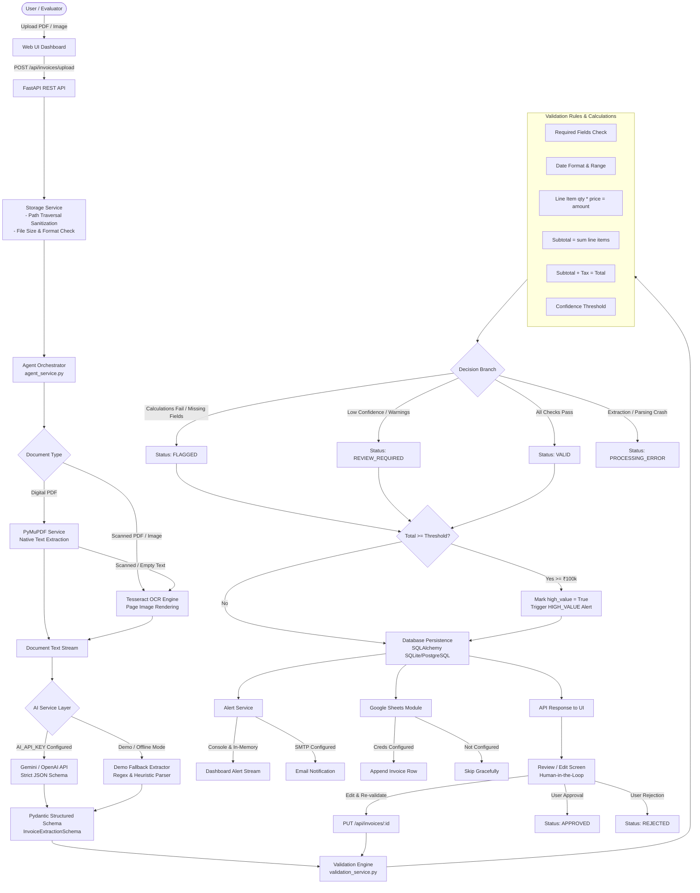

# AI Document and Invoice Processing Agent - Architecture

## System Architecture Overview

The system is built as an autonomous, modular AI document processing agent capable of handling diverse financial document formats (PDFs, scanned images, multi-page bills), performing intelligent OCR and multi-modal AI extraction, validating strict business and accounting rules, detecting calculation discrepancies, raising real-time alerts, and enabling a seamless human-in-the-loop review workflow.

---

## Processing Decision Logic & Status Matrix

| Check Condition | Severity | System Action | Result Status |
| :--- | :--- | :--- | :--- |
| **Missing Vendor, Inv #, Date, or Total** | Critical Error | Check `required_fields` marked FAIL | `FLAGGED` |
| **Line Item Calculation Mismatch** (`qty × price ≠ amount`) | Calculation Error | Check `line_items` marked FAIL | `FLAGGED` |
| **Subtotal Sum Mismatch** (`sum(items) ≠ subtotal`) | Calculation Error | Check `subtotal` marked FAIL | `FLAGGED` |
| **Total Mismatch** (`subtotal + tax ≠ total`) | Calculation Error | Check `total` & `tax` marked FAIL | `FLAGGED` |
| **Total Amount ≥ Threshold** (e.g. ₹100,000) | Financial Risk | `high_value = True`, Dispatch Alert | Retains base status + High Value badge |
| **Extraction Confidence < 0.75** | Advisory | Added to warnings list | `REVIEW_REQUIRED` |
| **All Checks Balanced & Pass** | Normal | Verified | `VALID` |
| **Human Auditor Verifies & Approves** | Manual Action | Audit log updated | `APPROVED` |
| **Human Auditor Rejects** | Manual Action | Audit log updated | `REJECTED` |

---

## Component Separation

1. **`app/services/pdf_service.py`**:
   - PyMuPDF native page extraction.
   - Heuristic scanned PDF detection (`len(text) < 40 chars`).
   - High-DPI page rendering to PIL images for OCR.

2. **`app/services/ocr_service.py`**:
   - Tesseract OCR interface with PSM modes.
   - Graceful host fallback if binary is absent on machine.

3. **`app/services/ai_extraction_service.py`**:
   - Provider abstraction: Gemini, OpenAI, Demo Fallback.
   - Schema enforcement via Pydantic.
   - Explicit `extraction_mode` logging.

4. **`app/services/validation_service.py`**:
   - Deterministic mathematical and business rule verification.
   - Decimal rounding tolerance (0.05).

5. **`app/services/alert_service.py`**:
   - Alert stream logging and optional SMTP dispatch.

6. **`app/services/sheets_service.py`**:
   - Optional Google Sheets export with graceful non-configured status.
